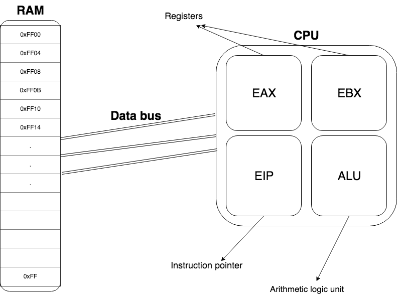

## Registers
A register is a form of memory located directly on the CPU.
Registers can hold just one value, typically 32-bit or 64-bit depending on your system.
Some special registers can actually contain 128-bit data, and are used for SIMD (Single instruction multiple data) operations, commonly used in computer graphics for vector and matrix math. These will not be used in either of the 2nd year Assembly modules.
Typically, or at least in MASM, registers are called E<Letter>X, eg. EAX, EBX, ECX, EDX, which are the 4 registers you will use most often.
There are other registers such as ESP (Stack pointer), EBP (Base pointer), EIP (Instruction pointer) which you will encounter later on in the course once you start getting into writing your own functions (hopefully, I don't know what donal is going to choose to teach).

Why should you care about registers?
They are located on the CPU making accessing them extremely efficient. You may think RAM is fast, but in fact, accessing RAM eg. using a `mov` operation can take thousands of CPU cycles. You want to write your code in such a way that you make the most use out of registers and don't have to resort to hitting the RAM very often.
However, you cannot always trust registers. After calling a function using `invoke` or other methods, you are not guaranteed to have the same contents in the registers as before calling the function.
The reason for this is simple. Functions have to use EBP to keep track of the stack, and other registers to run fast. Once the function is finished executing, it is a convention to store the return value in EAX.
If you have important values that you need to keep track of, store them in RAM.
There will be times you can slightly re-order your code to move the function invocation either before or after operating on the registers to avoid unnecessary RAM access.

## Arithmetic logic unit
This is the part of the CPU that performs maths and logical operations such as comparisons.
### Bitwise operations
Note: `and`, `or`, `not` are actually bitwise operations instead of logical ones, meaning they operate on the binary representation of your data.
Say in EAX you had 01101101 and in EBX you had 00110101. Executing `and eax, ebx` will result in EAX containing the value 00100101.
### Arithmetic operations
Arithmetic operations include:

| Operation | Arguments | Returns to | Note |
| - | - | - | - |
| `add` | dst, src | dst |  |
| `sub` | dst, src | dst |  |
| `mul` | dst | eax | IIRC `mul` multiplies whatever value is in dst by what is in eax |
| `div` | dst | eax | Same as `mul`, but before performing `div` you must clear the edx register (That's where remainder goes) |
| `inc` | src | src | Increments whatever is in src by 1 |
| `dec` | src | src | Decrements whatever is in src by 1 |

There are many more, but those are the ones you will be using most often.
### Comparisons
To compare between values you use the the operation `cmp dst, src`, followed directly by:

| Operation | Meaning |
| - | - |
| `je` | Jump if equal |
| `jg` | Jump if greater |
| `jl` | Jump if less |
| `jge` | Jump if greater or equal |
| `jle` | Jump if less or equal |

Following the keyword is a *label*. I will get onto labels later. eg. `je loopStart`.

## Labels
